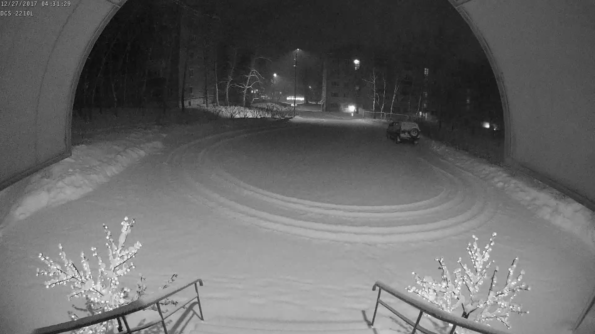
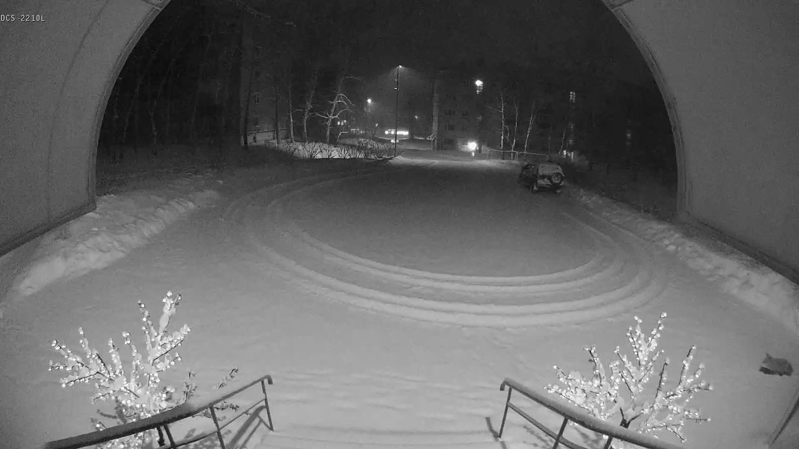
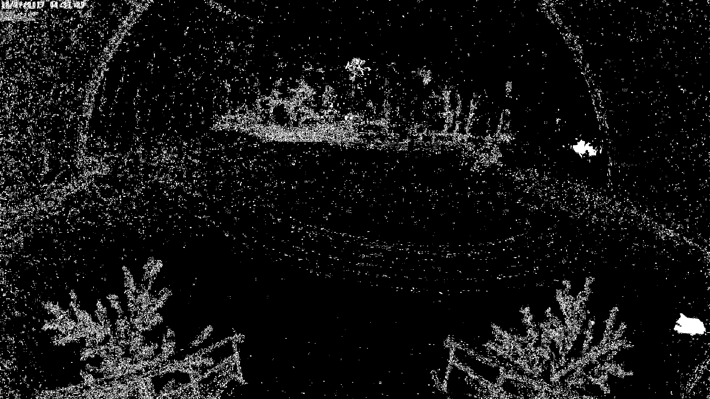
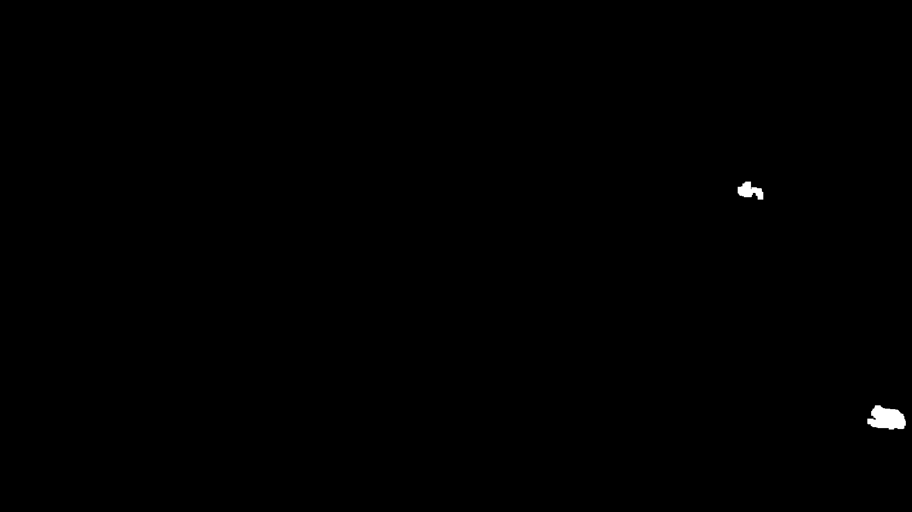
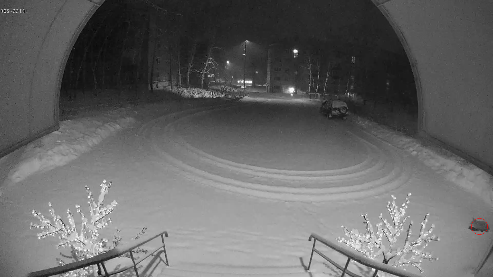
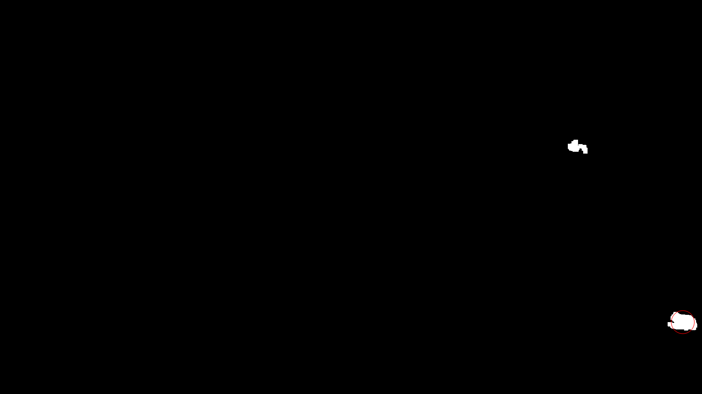

# Motion Detector

Python модуль для сравнения двух кадров из видеозаписи на предмет наличия движения в них.

***

## Установка

### Установка пакета с PyPi

```bash
$ pip install motion-detector-g4
```

### Установка пакета из исходного кода

Исходный код размещается на [GitHub](https://github.com/Genzo4/motion_detector).  
Скачайте его и установите пакет:

```bash
$ git clone https://github.com/Genzo4/motion_detector
$ cd motion_detector
$ pip3 install .
```

***

## Использование

Подключаем:
```python
from motion_detector_g4 import MotionDetector
```

Создаём экземпляр детектора движения. Можно указать дополнительные параметры:
- minArea - минимальный размер отслеживаемого изменения (размера blob'а).
  Значение по умолчанию: 4000.
- maxArea - максимальный размер отслеживаемого изменения (размера blob'а).
  Значение по умолчанию: 150000.
- noiseSize - максимальный размер удаляемого "шума".
  Значение по умолчанию: 10.
- debug - режим отладки. Если его включить, то создаются промежуточные кадры,
  показывающие процесс обработки.
  Значение по умолчанию: False.

```python
md = MotionDetector(minArea = 4000, maxArea = 150000, noiseSize = 10, debug = False)
```

В модуле используется следующий алгоритм:
1. Подаётся на обработку первый кадр (метод applyFirstFrame).

2. Подаётся на обработку следующий кадр (метод checkMotion).

   - из этого кадра "вычитается" первый кадр с помощью модуля BackgroundSubtractorMOG2
     из библиотеки OpenCV. Если включён режим отладки, то создаётся файл с добавочным
     расширением "mask" с результатом работы модуля.  
     
   - удаляем "шум" с помощью модуля morphologyEx из библиотеки OpenCV. Данный процесс
     настраивается с помощью параметра noiseSize. Если включён режим отладки, то
     создаётся файл с добавочным расширением "clear" с результатом работы модуля.
     
   - ищем области движения (blob'ы) размером больше minArea, но меньше maxArea. Если включён режим отладки, то
     создаются файлы с добавочным расширением "blobs" и "blobs2" с результатом работы модуля 
     (найденные области обводятся красными кругами).
     
     

Пример использования см. в файле example.py
